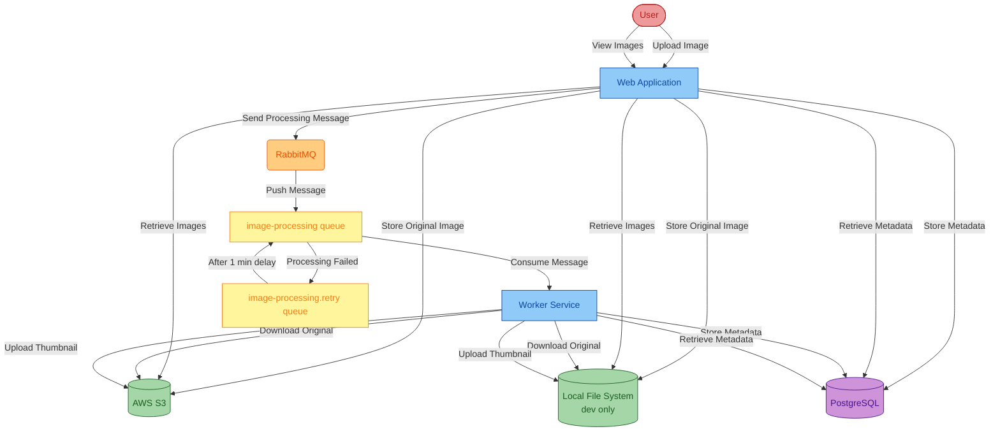

<!-- l10n-sync: source-file="README.md" -->
# Asset Manager

Este documento sirve como una guía completa de taller que lo guiará a través del proceso de modernización de una aplicación Java utilizando GitHub Copilot app modernization. El taller cubre evaluación, actualizaciones de Java/frameworks, endpoints de salud y contenedorización.

**Lo que hará el Proceso de Modernización:**
La modernización transformará su aplicación de las tecnologías obsoletas a una solución moderna. Esto incluye la actualización de Java 8 a Java 21, la migración de Spring Boot 2.x a 3.x, la adición de health checks y la contenedorización de las aplicaciones.

## Tabla de Contenidos

- [Descripción General](#descripción-general)
- [Arquitectura Actual](#arquitectura-actual)
- [Ejecutar Localmente](#ejecutar-localmente)
- [Taller de Modernización de Aplicaciones](#taller-de-modernización-de-aplicaciones)

## Descripción General

La rama [main](https://github.com/copilot-dev-days/appmod-workshop-java/tree/main) del proyecto asset-manager es el estado original antes de ser modernizado. Está organizado de la siguiente manera:
* AWS S3 para almacenamiento de imágenes, usando autenticación basada en contraseña (access key/secret key)
* RabbitMQ para colas de mensajes, usando autenticación basada en contraseña
* Base de datos PostgreSQL para almacenamiento de metadatos, usando autenticación basada en contraseña

En este taller, utilizará la extensión **GitHub Copilot app modernization** para evaluar, actualizar y contenedorizar el proyecto.

**Estimaciones de Tiempo:**
El taller completo toma aproximadamente **35 minutos** para completarse. Aquí está el desglose para cada paso principal:
- **Evaluar Su Aplicación Java**: ~5 minutos
- **Actualizar Runtime y Frameworks**: ~10 minutos
- **Exponer Endpoints de Salud**: ~15 minutos
- **Contenedorizar Aplicaciones**: ~5 minutos


## Arquitectura Actual

Autenticación basada en contraseña

## Ejecutar Localmente

Clone el repositorio y abra la carpeta asset-manager para ejecutar el proyecto actual localmente:

```bash
git clone https://github.com/copilot-dev-days/appmod-workshop-java.git
cd appmod-workshop-java
```

**Prerrequisitos**: 
- [JDK 8](https://learn.microsoft.com/en-us/java/openjdk/download#openjdk-8): Requerido para ejecutar la aplicación inicial localmente.
- [Maven 3.6.0+](https://maven.apache.org/install.html): Requerido para compilar la aplicación localmente.
- [Docker](https://docs.docker.com/desktop/): Requerido para ejecutar la aplicación localmente.

Ejecute los siguientes comandos para iniciar las aplicaciones localmente. Esto:
* Usará el sistema de archivos local en lugar de S3 para almacenar imágenes
* Iniciará RabbitMQ y PostgreSQL usando Docker

Windows:

```batch
scripts\startapp.cmd
```

Linux:

```bash
scripts/startapp.sh
```

Para detener, ejecute `stopapp.cmd` o `stopapp.sh` en el directorio `scripts`.

## Taller de Modernización de Aplicaciones

¿Listo para modernizar esta aplicación? Siga la guía paso a paso del taller:

👉 **[Iniciar el Taller →](WORKSHOP.es.md)**

El taller cubre:
- Instalación de GitHub Copilot app modernization
- Evaluación de su aplicación Java
- Actualización de runtime y frameworks (Java 8 → 21, Spring Boot 2.x → 3.x)
- Exposición de endpoints de salud usando custom skills
- Contenedorización de aplicaciones
