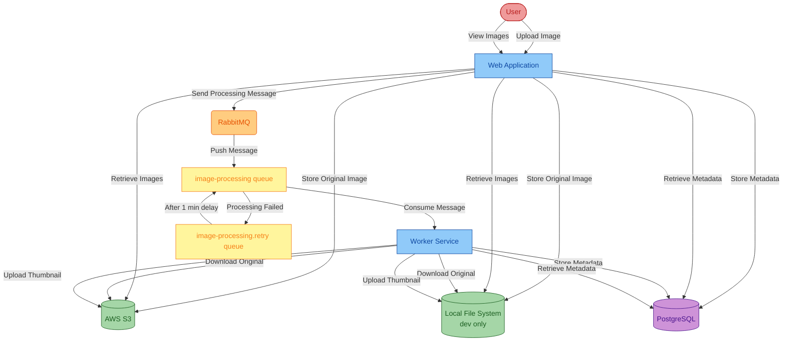

<!-- l10n-sync: source-file="README.md" -->
# Asset Manager

Este documento serve como um guia abrangente de workshop que irá orientá-lo no processo de modernização de uma aplicação Java usando o GitHub Copilot app modernization. O workshop abrange avaliação, atualizações de Java/frameworks, endpoints de saúde e conteinerização.

**O que o Processo de Modernização Fará:**
A modernização transformará sua aplicação das tecnologias desatualizadas para uma solução moderna. Isso inclui a atualização do Java 8 para o Java 21, a migração do Spring Boot 2.x para o 3.x, a adição de health checks e a conteinerização das aplicações.

## Índice

- [Visão Geral](#visão-geral)
- [Arquitetura Atual](#arquitetura-atual)
- [Executar Localmente](#executar-localmente)
- [Workshop de Modernização de Aplicações](#workshop-de-modernização-de-aplicações)

## Visão Geral

O branch [main](https://github.com/copilot-dev-days/appmod-workshop-java/tree/main) do projeto asset-manager é o estado original antes de ser modernizado. Ele está organizado da seguinte forma:
* AWS S3 para armazenamento de imagens, usando autenticação baseada em senha (access key/secret key)
* RabbitMQ para filas de mensagens, usando autenticação baseada em senha
* Banco de dados PostgreSQL para armazenamento de metadados, usando autenticação baseada em senha

Neste workshop, você usará a extensão **GitHub Copilot app modernization** para avaliar, atualizar e conteinerizar o projeto.

**Estimativas de Tempo:**
O workshop completo leva aproximadamente **35 minutos** para ser concluído. Aqui está a divisão para cada etapa principal:
- **Avaliar Sua Aplicação Java**: ~5 minutos
- **Atualizar Runtime e Frameworks**: ~10 minutos
- **Expor Endpoints de Saúde**: ~15 minutos
- **Conteinerizar Aplicações**: ~5 minutos


## Arquitetura Atual

Autenticação baseada em senha

## Executar Localmente

Clone o repositório e abra a pasta asset-manager para executar o projeto atual localmente:

```bash
git clone https://github.com/copilot-dev-days/appmod-workshop-java.git
cd appmod-workshop-java
```

**Pré-requisitos**: 
- [JDK 8](https://learn.microsoft.com/en-us/java/openjdk/download#openjdk-8): Necessário para executar a aplicação inicial localmente.
- [Maven 3.6.0+](https://maven.apache.org/install.html): Necessário para compilar a aplicação localmente.
- [Docker](https://docs.docker.com/desktop/): Necessário para executar a aplicação localmente.

Execute os seguintes comandos para iniciar as aplicações localmente. Isso irá:
* Usar o sistema de arquivos local em vez do S3 para armazenar imagens
* Iniciar o RabbitMQ e o PostgreSQL usando Docker

Windows:

```batch
scripts\startapp.cmd
```

Linux:

```bash
scripts/startapp.sh
```

Para parar, execute `stopapp.cmd` ou `stopapp.sh` no diretório `scripts`.

## Workshop de Modernização de Aplicações

Pronto para modernizar esta aplicação? Siga o guia passo a passo do workshop:

👉 **[Iniciar o Workshop →](WORKSHOP.pt_BR.md)**

O workshop abrange:
- Instalação do GitHub Copilot app modernization
- Avaliação da sua aplicação Java
- Atualização de runtime e frameworks (Java 8 → 21, Spring Boot 2.x → 3.x)
- Exposição de endpoints de saúde usando custom skills
- Conteinerização de aplicações
