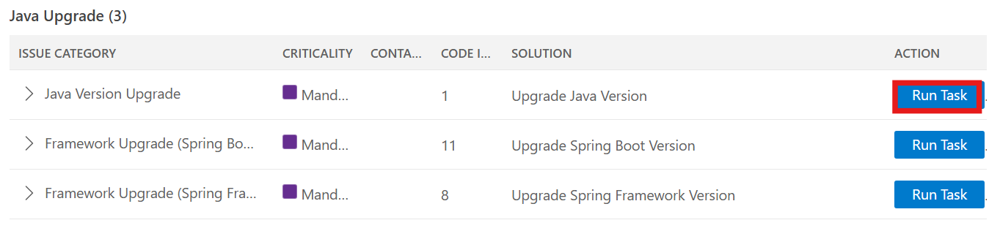
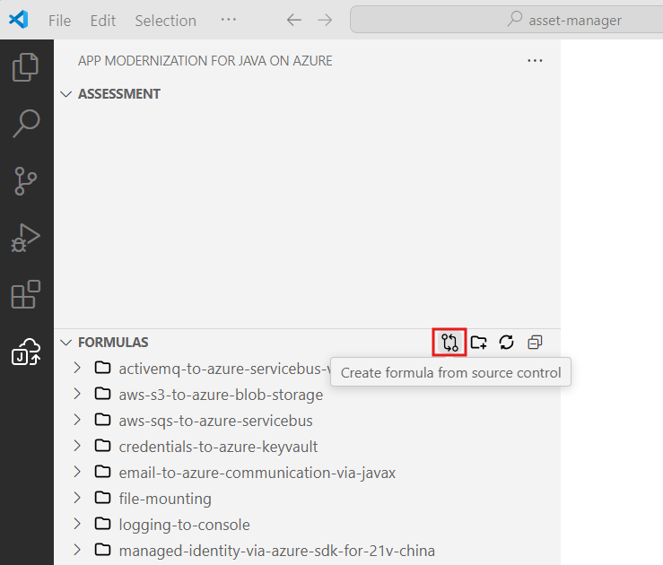
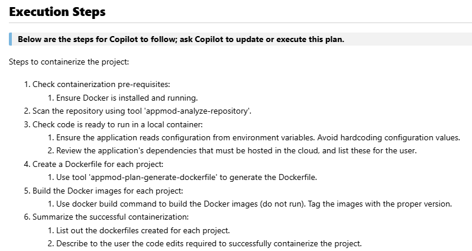

<!-- l10n-sync: source-file="WORKSHOP.md" -->
# Taller de Modernización de Aplicaciones

Las siguientes secciones lo guían a través del proceso de modernización de la aplicación Java de ejemplo `asset-manager` para Azure usando GitHub Copilot app modernization.

## Tabla de Contenidos

- [Prerrequisitos](#prerrequisitos)
- [Instalar GitHub Copilot app modernization](#instalar-github-copilot-app-modernization)
- [Evaluar Su Aplicación Java](#evaluar-su-aplicación-java)
- [Actualizar Runtime y Frameworks](#actualizar-runtime-y-frameworks)
- [Exponer endpoints de salud usando Custom Skills](#exponer-endpoints-de-salud-usando-custom-skills)
- [Contenedorizar Aplicaciones](#contenedorizar-aplicaciones)

## Prerrequisitos

- Una cuenta de GitHub con [GitHub Copilot](https://github.com/features/copilot) habilitado. Se requiere un plan Pro, Pro+, Business o Enterprise.
- Uno de los siguientes IDEs:
  - La versión más reciente de [Visual Studio Code](https://code.visualstudio.com/). Debe ser la versión 1.101 o posterior.
    - [GitHub Copilot en Visual Studio Code](https://code.visualstudio.com/docs/copilot/overview). Para instrucciones de configuración, consulte [Configurar GitHub Copilot en Visual Studio Code](https://code.visualstudio.com/docs/copilot/setup). Asegúrese de iniciar sesión en su cuenta de GitHub dentro de Visual Studio Code.
    - [GitHub Copilot app modernization](https://marketplace.visualstudio.com/items?itemName=vscjava.migrate-java-to-azure). Reinicie Visual Studio Code después de la instalación.
  - La versión más reciente de [IntelliJ IDEA](https://www.jetbrains.com/idea/download). Debe ser la versión 2023.3 o posterior.
    - [GitHub Copilot](https://plugins.jetbrains.com/plugin/17718-github-copilot). Debe ser la versión 1.5.59 o posterior. Para más instrucciones, consulte [Configurar GitHub Copilot en IntelliJ IDEA](https://docs.github.com/en/copilot/get-started/quickstart). Asegúrese de iniciar sesión en su cuenta de GitHub dentro de IntelliJ IDEA.
    - [GitHub Copilot app modernization](https://plugins.jetbrains.com/plugin/28791-github-copilot-app-modernization). Reinicie IntelliJ IDEA después de la instalación. Si no tiene GitHub Copilot instalado, puede instalar GitHub Copilot app modernization directamente.
    - Para un uso más eficiente de Copilot en la modernización de aplicaciones: en la configuración de IntelliJ IDEA, seleccione la ventana de configuración **Tools** > **GitHub Copilot**, y luego seleccione **Auto-approve** y **Trust MCP Tool Annotations**. Para más información, consulte [Configurar ajustes de GitHub Copilot app modernization para optimizar la experiencia en IntelliJ](configure-settings-intellij.md).
- [Java JDK](/java/openjdk/download) para las versiones de JDK de origen y destino.
- [Maven](https://maven.apache.org/download.cgi) o [Gradle](https://gradle.org/install/) para compilar proyectos Java.
- Un proyecto Java gestionado con Git usando Maven o Gradle.
- Para proyectos basados en Maven: acceso al repositorio público Maven Central.
- En la configuración de Visual Studio Code, asegúrese de que `chat.extensionTools.enabled` esté configurado como `true`. Esta configuración puede ser controlada por su organización.

> Nota: Si está usando Gradle, solo se admite el Gradle wrapper versión 5+. El Kotlin Domain Specific Language (DSL) no es compatible.
>
> La funcionalidad `My Tasks` aún no es compatible con IntelliJ IDEA.

## Clonar el Repositorio

```bash
git clone https://github.com/copilot-dev-days/appmod-workshop-java.git
cd appmod-workshop-java
```

## Instalar GitHub Copilot app modernization

En VSCode, abra la vista de Extensiones desde la Barra de Actividades, busque la extensión `GitHub Copilot app modernization` en el marketplace. Haga clic en el botón Instalar para la extensión. Después de completar la instalación, debería ver una notificación en la esquina inferior derecha de VSCode confirmando el éxito.

**Alternativa: IntelliJ IDEA**
Alternativamente, puede usar IntelliJ IDEA. Abra **File** > **Settings** (o **IntelliJ IDEA** > **Preferences** en macOS), navegue a **Plugins** > **Marketplace**, busque `GitHub Copilot app modernization` y haga clic en **Install**. Reinicie IntelliJ IDEA si se le solicita.

## Evaluar Su Aplicación Java

El primer paso es evaluar la aplicación Java de ejemplo `asset-manager`. La evaluación proporciona información sobre la preparación de la aplicación para la migración a Azure.

1. Abra VS Code con todos los prerrequisitos instalados para el asset manager, cambiando el directorio al directorio `asset-manager` y ejecutando `code .` en ese directorio.
1. En la barra lateral de Actividades, abra el panel de la extensión **GitHub Copilot app modernization**.
1. En la sección **QUICKSTART**, haga clic en **Start Assessment** para iniciar la evaluación de la aplicación.

   

1. Espere a que se complete la evaluación. Este paso puede tardar varios minutos.
1. Al completarse, se abrirá una pestaña **Assessment Report**. Este informe proporciona una vista categorizada de problemas de preparación para la nube y soluciones recomendadas. Seleccione la pestaña **Issues** para ver las soluciones propuestas y continuar con los pasos de migración.

## Actualizar Runtime y Frameworks

1. En la tabla **Java Upgrade** en la parte inferior de la pestaña **Issues**, haga clic en el botón **Run Task** de la primera entrada **Java Version Upgrade**.

    
1. Después de hacer clic en el botón **Run Task**, el panel de Copilot Chat se abrirá con el Agent Mode. El agente creará una nueva rama y comenzará a actualizar la versión del JDK y el framework Spring/Spring Boot. Haga clic en **Allow** para cualquier solicitud del agente.

> Nota: La herramienta de actualización también admite la actualización a JDK 25 (la versión LTS más reciente). Para hacer esto, haga clic en el mensaje de chat generado, edite la versión de Java de destino a 25 y luego haga clic en **Send** para aplicar el cambio.

## Exponer endpoints de salud usando Custom Skills

En esta sección, utilizará custom skills para exponer endpoints de salud para sus aplicaciones en lugar de escribir código usted mismo. Los siguientes pasos demuestran cómo crear una custom skill con referencias y prompts adecuados.

> Nota: Las custom skills (My Skills) no son compatibles con el plugin de IntelliJ IDEA. Si está usando IntelliJ IDEA, puede omitir esta sección.

1. En la barra lateral de Actividades, abra el panel de la extensión **GitHub Copilot app modernization**. Pase el cursor sobre la sección **TASKS** y luego seleccione **Create a Custom Skill**.

   
1. Se abrirá un formulario **Create a Skill** con los siguientes campos. Complételos como se muestra a continuación:
   - **Skill Name**: `expose-health-endpoint`
   - **Skill Description**: `This skill helps add Spring Boot Actuator health endpoints for Azure Container Apps deployment readiness.`
   - **Skill Content**: `You are a Spring Boot developer assistant, follow the Spring Boot Actuator documentation to add basic health endpoints for Azure Container Apps deployment.`

1. Haga clic en **Add Resources** para agregar la documentación oficial de Spring Boot Actuator como recurso. Pegue el siguiente enlace: `https://docs.spring.io/spring-boot/reference/actuator/endpoints.html`.

   
1. Haga clic en **Save** para crear la skill. Su custom skill ahora aparece en la sección **TASKS** > **My Skills**.
1. Haga clic en **Run** para ejecutarla.
1. La ventana de Copilot chat se abre en Agent Mode y genera automáticamente el plan de migración, crea una nueva rama, realiza cambios en el código y ejecuta el ciclo de validación y corrección. Haga clic en **Allow** para cualquier solicitud de llamada de herramienta del agente.
1. Revise los cambios de código propuestos y haga clic en **Keep** para aplicarlos.

## Contenedorizar Aplicaciones

Ahora que ha completado los pasos de actualización y endpoint de salud, el siguiente paso es preparar su aplicación para la implementación en la nube contenedorizando los módulos web y worker. En esta sección, utilizará **Containerization Tasks** para contenedorizar sus aplicaciones.

1. En la barra lateral de Actividades, abra el panel de la extensión **GitHub Copilot app modernization**. En la sección **TASKS**, expanda **Common Tasks** > **Containerize Tasks** y haga clic en el botón de ejecución para **Containerize Application**.
  
    

1. Un prompt predefinido se completará en el panel de Copilot Chat con el Agent Mode. El Copilot Agent comenzará a analizar el workspace y creará un **containerization-plan.copiotmd** con el plan de contenedorización.

    
1. Vea el plan y colabore con el Copilot Agent mientras sigue los **Execution Steps** del plan, haciendo clic en **Continue**/**Allow** en las notificaciones emergentes del chat para ejecutar comandos. Algunos de los pasos de ejecución aprovechan las herramientas agénticas de **Container Assist**.

    <!--  -->
1. El Copilot Agent ayudará a generar Dockerfile, construir imágenes Docker y corregir errores de compilación si los hay. Haga clic en **Keep** para aplicar el código generado.
