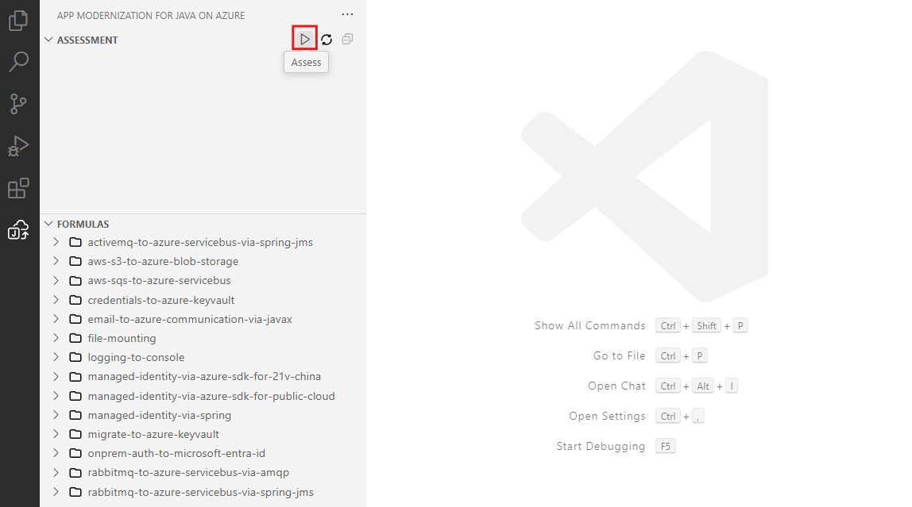

# Step 2: Assess Your Java Application

## 🎯 Goal

Run the GitHub Copilot app modernization assessment on the `asset-manager` application to understand its current state and identify modernization opportunities.

## Run the Assessment

1. Open VS Code with all the prerequisites installed for the asset manager by navigating to the root of the cloned repository and running `code .` in that directory.
1. In the Activity sidebar, open the **GitHub Copilot app modernization** extension pane.
1. In the **QUICKSTART** section, click **Start Assessment** to trigger the app assessment.

   

1. Wait for the assessment to be completed. This step could take several minutes.
1. Upon completion, an **Assessment Report** tab opens. This report provides a categorized view of cloud readiness issues and recommended solutions. Select the **Issues** tab to view proposed solutions and proceed with migration steps.

## Understanding the Assessment Report

The assessment report provides:
- **Application overview** — Summary of detected technologies, frameworks, and dependencies
- **Issues** — Identified compatibility issues and proposed solutions
- **Java Upgrade tasks** — Specific tasks for upgrading Java and framework versions
- **Recommendations** — Suggestions for modernization steps

> [!TIP]
> Take a moment to review the full assessment report. Understanding the current state of the application will help you make better decisions during the modernization process.

## ✅ Checkpoint

- [ ] Assessment triggered from the QUICKSTART section
- [ ] Assessment report generated successfully
- [ ] Issues tab reviewed with proposed solutions
