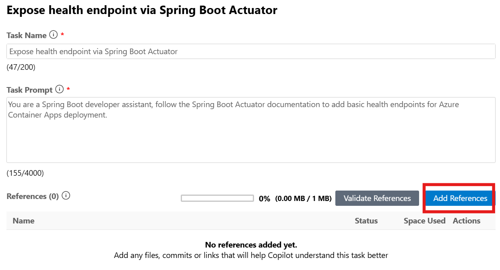

# Step 4: Expose Health Endpoints using Custom Skills

## 🎯 Goal

Use custom skills to expose health endpoints for your applications using Spring Boot Actuator, without writing code yourself.

> [!NOTE]
> Custom skills (My Skills) are not supported for the IntelliJ IDEA plugin. If you are using IntelliJ IDEA, you can skip this section.

## Create a Custom Skill

1. In the Activity sidebar, open the **GitHub Copilot app modernization** extension pane. Hover over the **TASKS** section, and then select **Create a Custom Skill**.

   

1. A **Create a Skill** form opens with the following fields. Fill them in as shown below:
   - **Skill Name**: `expose-health-endpoint`
   - **Skill Description**: `This skill helps add Spring Boot Actuator health endpoints for Azure Container Apps deployment readiness.`
   - **Skill Content**: `You are a Spring Boot developer assistant, follow the Spring Boot Actuator documentation to add basic health endpoints for Azure Container Apps deployment.`

1. Click **Add Resources** to add the Spring Boot Actuator official documentation as a resource. Paste the following link: `https://docs.spring.io/spring-boot/reference/actuator/endpoints.html`.

   

1. Click **Save** to create the skill. Your custom skill now appears in the **TASKS** > **My Skills** section.

## Run the Custom Skill

1. Click **Run** to execute it.
1. The Copilot chat window opens in Agent Mode and automatically generates the migration plan, checks out a new branch, performs code changes, and runs the validation and fix iteration loop. Click **Allow** for any tool call requests from the agent.
1. Review the proposed code changes and click **Keep** to apply them.

## What This Does

The custom skill will:
- Add the Spring Boot Actuator dependency to `pom.xml`
- Configure health endpoints in `application.properties` or `application.yml`
- Expose `/actuator/health` endpoint for Azure Container Apps health probes
- This is essential for cloud deployment where the platform needs to check if your app is healthy

> [!TIP]
> Custom skills are a powerful feature of GitHub Copilot app modernization. You can create skills for any modernization need by providing a descriptive prompt and relevant documentation references.

## ✅ Checkpoint

- [ ] Custom skill created with the correct name and prompt
- [ ] Spring Boot Actuator documentation added as resource
- [ ] Skill executed successfully
- [ ] Health endpoint code changes reviewed and applied
- [ ] `/actuator/health` endpoint will be available when the app runs
