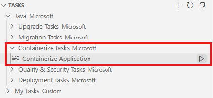

# Step 5: Containerize Applications

## 🎯 Goal

Prepare your modernized application for cloud deployment by containerizing both the web and worker modules using GitHub Copilot app modernization's containerization tasks.

## Run the Containerization Task

1. In the Activity sidebar, open the **GitHub Copilot app modernization** extension pane. In the **TASKS** section, expand **Common Tasks** > **Containerize Tasks** and click the run button for **Containerize Application**.

    

1. A predefined prompt will be populated in the Copilot Chat panel with Agent Mode. Copilot Agent will start to analyze the workspace and to create a **containerization-plan.copilotmd** with the containerization plan.

    

1. View the plan and collaborate with Copilot Agent as it follows the **Execution Steps** in the plan by clicking **Continue**/**Allow** in pop-up chat notifications to run commands. Some of the execution steps leverage agentic tools of **Container Assist**.

1. Copilot Agent will help generate Dockerfile, build Docker images and fix build errors if there are any. Click **Keep** to apply the generated code.

## What This Does

The containerization process will:
- Analyze the project structure (web module + worker module)
- Generate optimized `Dockerfile` for each module
- Configure multi-stage builds for smaller image sizes
- Set up proper Java runtime configurations
- Build and test the Docker images locally

## ✅ Checkpoint

- [ ] Containerization task triggered from the Tasks view
- [ ] Containerization plan generated (`containerization-plan.copiotmd`)
- [ ] Dockerfiles generated for both web and worker modules
- [ ] Docker images built successfully

## 🎉 Congratulations!

You've completed the App Modernization workshop! Here's what you accomplished:

- ✅ **Assessed** the legacy Java application to understand modernization needs
- ✅ **Upgraded** from Java 8 → 21 and Spring Boot 2.x → 3.x
- ✅ **Added health endpoints** using custom skills and Spring Boot Actuator
- ✅ **Containerized** the application for cloud deployment

### What's Next?

- Deploy your containerized app to **Azure Container Apps**
- Explore more [GitHub Copilot app modernization](https://marketplace.visualstudio.com/items?itemName=vscjava.migrate-java-to-azure) features
- Check out the [Copilot Prompts Guide](../PROMPTS.md) for additional prompts used during development
- Visit the other [Copilot Dev Days workshops](https://github.com/copilot-dev-days)
